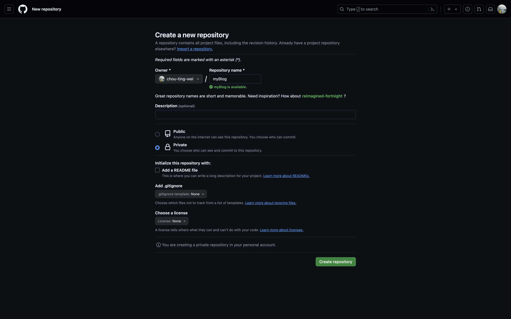
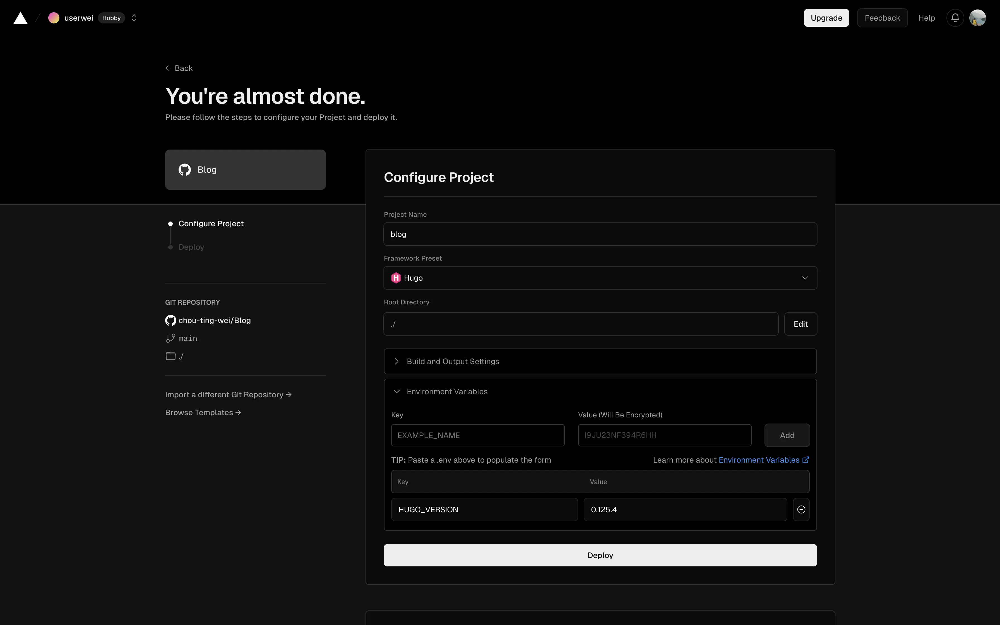
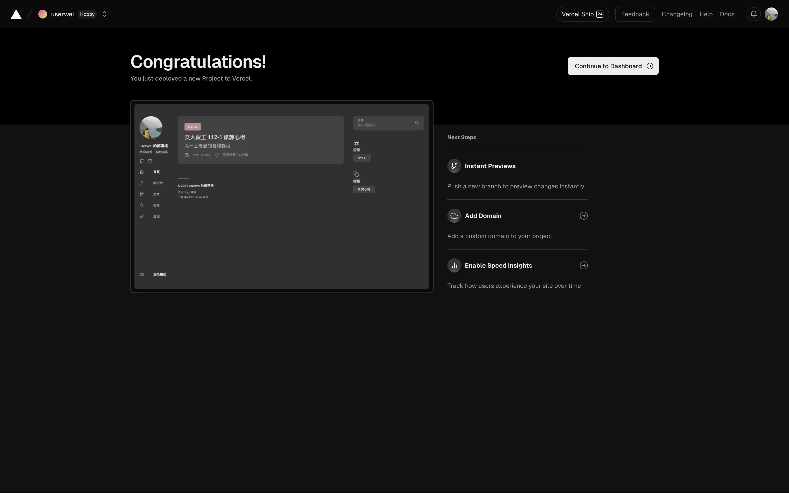
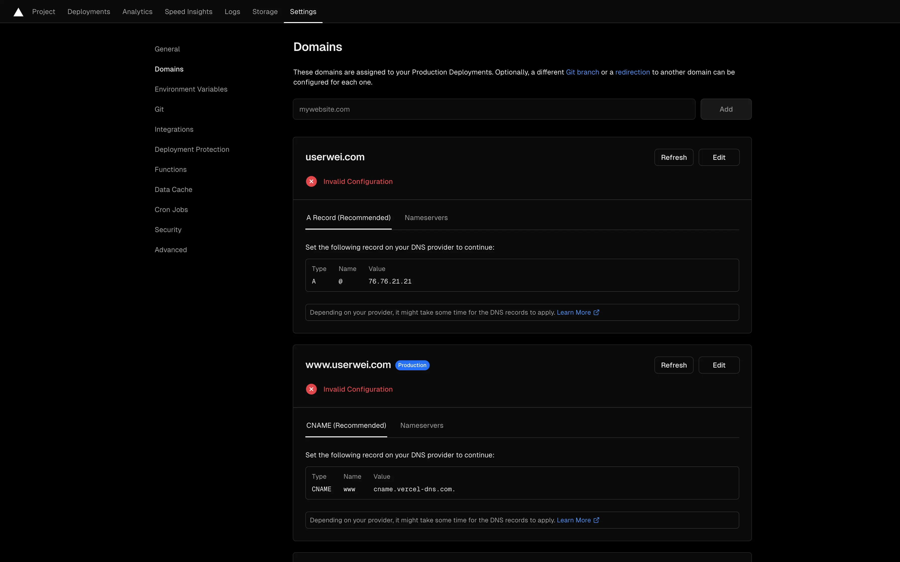
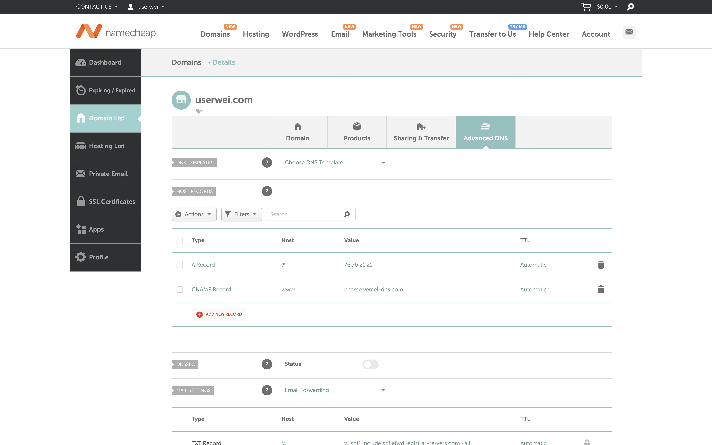
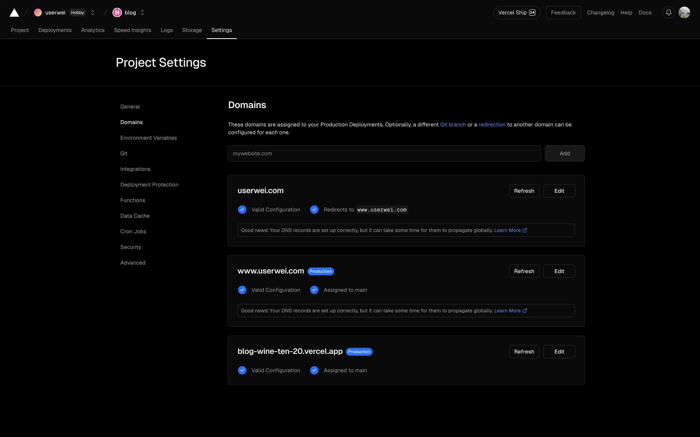
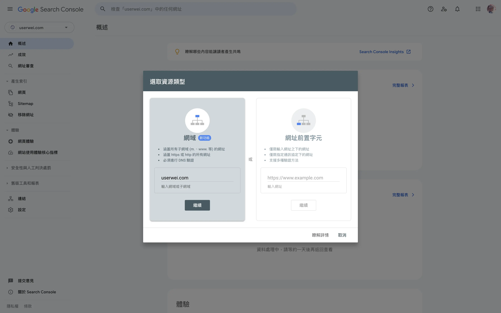
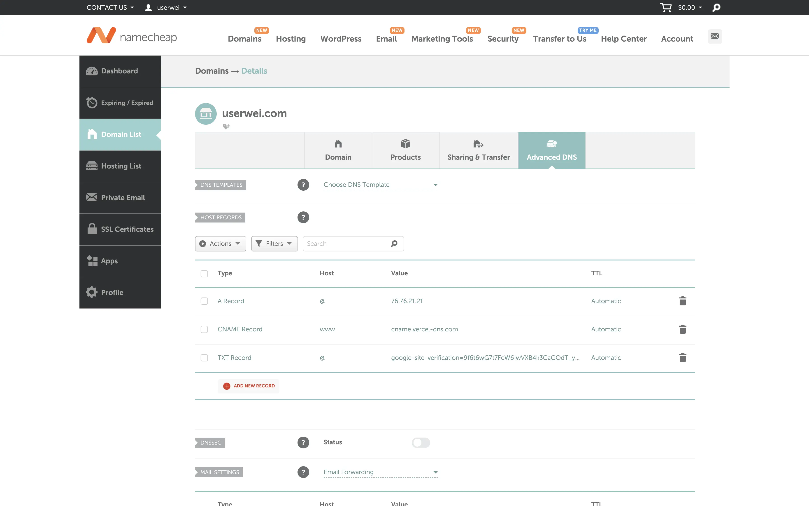

* All commands prefixed with `$` should be replaced as appropriate unless specified otherwise.
* For any questions, feel free to leave a comment below or [email me](mailto:userwei.blog@gmail.com).

## Hugo
[Hugo](https://gohugo.io/) is a static site generator developed in Go, touted as the world's fastest site-building tool. Apart from its high speed, Hugo offers a variety of themes and supports real-time rendering and multilingual switching, enhancing both the writing and website setup experience.

### Installing Hugo
Since Hugo does not have a GUI, it needs to be installed via the command line. Here are the [installation methods](https://gohugo.io/categories/installation/) provided by Hugo for different operating systems:
```sh
# Windows
choco install hugo-extended

# macOS
brew install hugo

# Linux
sudo snap install hugo
```

After installing, use the following command to test if Hugo was installed successfully:
```sh
hugo version
```  
### Install Git
Download and install from the [Git](https://git-scm.com/) official website.

### Initialize Environment
Choose the folder where the webpage will be stored, and enter the following command to create a new webpage:
```sh
hugo new site $siteName
```  
After completion, the following files will be generated in the `$siteName` folder:
```
├── archetypes
│   └── default.md
├── assets
├── content
├── data
├── hugo.toml
├── i18n
├── layouts
├── static
└── themes
```  
To easily push to GitHub, let's first enter the folder that was just created and initialize the entire Git repository:
```sh
cd $siteName
git init
```  

### Choose a Theme
In [Hugo Themes](https://themes.gohugo.io/), there are many types of themes available for personal preference. Here, I choose the [Stack](https://stack.jimmycai.com/) theme as an example.  
!stack
1. Open the terminal in the root directory of the site and use `git submodule` to download the theme to the `themes` folder:
    ```sh
    git submodule add https://github.com/CaiJimmy/hugo-theme-stack/ themes/hugo-theme-stack
    ```   
2. Delete the `hugo.toml` file and copy the `config.yaml` from `themes/hugo-theme-stack` to the root directory, adding the following content at the top of this file:
    ```yaml
    baseurl: https://example.com
    languageCode: en-us
    theme: hugo-theme-stack
    paginate: 5
    title: $blogTitle
    ```  
3. Other settings can be modified according to personal preference by referring to the official Stack [Config](https://stack.jimmycai.com/config/):
   * Website icon setting  
    Place `favicon.webp` in the `static` folder and modify the following in `config.yaml`:
        ```yaml
        params:
            favicon: favicon.webp
        ```  
   * Sidebar setting  
      1. Place your avatar `avatar.webp` in the `assets/img` folder (create if it doesn't exist) and modify the following in `config.yaml`:
            ```yaml
            params:
                sidebar:
                    compact: false
                    emoji: 
                    subtitle: $subTitle
                    avatar:
                        enabled: true
                        local: true
                        src: img/avatar.webp
            ```  
       2. You can add links under the subtitle to direct to your GitHub or other websites by adding the following at the bottom of `config.yaml`:
            ```yaml
            menu:
                social:
                    - identifier: github
                      name: GitHub
                      url: $githubLink
                      params:
                          icon: brand-github
            ```  
       3. To add navigation, refer to the file content and structure in `themes/hugo-theme-stack/exampleSite`. After modification, the file structure in the `content` folder will look like this:
            ```
            ├── _index.md
            ├── categories
            ├── page
            │   ├── about
            │   │   └── index.md
            │   ├── archives
            │   │   └── index.md
            │   ├── links
            │   │   └── index.md
            │   └── search
            │       └── index.md
            └── post
            ```  
   * Article setting  
        Modify the following in `config.yaml` to support LaTeX in articles, and add table of contents, reading time, default CC license, etc.:
        ```yaml
        params:
            article:
                math: true
                toc: true
                readingTime: true
                license:
                    enabled: true
                    default: CC BY-NC-SA 4.0
        ```  
   * Comment setting
        1. Create a new account on [Disqus](https://disqus.com/) and a new site, then find the shortname in the settings.
        2. Modify the following in `config.yaml` to add comment functionality (replace `$shortName` with the shortname from Disqus settings):
            ```yaml
            disqusShortname: $shortName
            params:
                comments:
                    enabled: true
                    provider: disqus

                    disqusjs:
                        shortname: $shortName
                        apiUrl:
                        apiKey:
                        admin:
                        adminLabel:
            ```  
   * Widget setting  
        Modify the following in `config.yaml` to display search, table of contents, etc., in the homepage and articles:
        ```yaml
        params:
            widgets:
                homepage:
                    - type: search
                    - type: categories
                    params:
                        limit: 10
                    - type: tag-cloud
                    params:
                        limit: 10
                page: 
                    - type: search
                    - type: toc
        ```  

### Writing Articles
Hugo requires using [Markdown](https://www.markdownguide.org/getting-started/) syntax for writing articles. The method here is to create a folder for each article for easy organization.  
1. In the `content/post` folder, create a new folder named after the new article (preferably in English, with no spaces between words).
2. Add an `index.md` file in the folder. The file structure in the `content/post` folder will look like this:
    ```
    ├── myPost
    │   └── index.md
    └── myPost2
        └── index.md
    ```  
3. Use a text editor like [Visual Studio Code](https://code.visualstudio.com/) to edit `index.md`. Below is the basic file content (except for the article property structure, which can be modified):
    ```md
    ---
    title: myPost
    slug:  my-post
    date:  2024-05-20
    description: My first post
    categories:
        - Blog
    tags : 
        - First
    ---
    ## Hugo Blog
    content
    ```

### Preview Hugo Website
Use the built-in web page live preview feature to understand the current content of the web page.  
1. Enter the following command in the terminal:
    ```
    hugo server -D
    ```  
2. If there are no errors on the web page, the terminal will display the following content:
    ```
    Serving pages from disk
    Running in Fast Render Mode. For full rebuilds on change: hugo server --disableFastRender
    Web Server is available at http://localhost:1313/ (bind address 127.0.0.1) 
    Press Ctrl+C to stop
    ```  
3. Connect to `http://localhost:1313/` in the browser to preview the current web page.

### Push to GitHub
For the subsequent web deployment, it is necessary to push the web pages generated just now to [GitHub](https://github.com/), with the specific steps as follows:  
1. Create a new repository on GitHub and set the permission to Private, leaving the rest of the settings unchanged.

2. Create a `.gitignore` file in the root directory, with the following content:
    ```
    public
    resources
    assets/jsconfig.json
    .hugo_build.lock
    ```  
3. Copy the repository URL `https://github.com/xxx/xxx.git` from the page, and execute the following commands in the root directory (replace `$repoLink` with the repository URL) to push all files to the GitHub repository:
    ```sh
    git add .
    git commit -m "first commit"
    git branch -M main
    git remote add origin $repoLink
    git push -u origin main
    ```
## Vercel
[Vercel](https://vercel.com/) is a web hosting service platform, similar to [GitHub Pages](https://pages.github.com/) but more powerful and faster. Additionally, Vercel can automatically deploy new web pages with new Git pushes and offers 100GB of free traffic per month, which is a great boon for small website setups.

### Deploy Website
1. Log in to Vercel's official website with GitHub.
2. Select `Add New >> Project`, and choose the Git Repository you just set up from the list on the left.
3. Set `Framework Preset` to `Hugo`, and click to expand `Environment Variables` to add `HUGO_VERSION` with the version used locally (can be checked with the `hugo version` command):

4. If you see the following screen, the website deployment is complete.


### Link Domain
In the backend, you can see that Vercel provides a `xxx.vercel.app` URL for the newly deployed web page. If you want to change it to another custom URL, you need to obtain and link the domain yourself.
1. Obtain a domain from domain registrars like [Namecheap](https://www.namecheap.com/) or [GoDaddy](https://tw.godaddy.com/).
2. Change the `baseurl` in `config.yaml` to the obtained domain `https://www.xxx.com`:
    ```yaml
    baseurl: $domainName
    ```
3. Go to `Settings >> Domains` in the backend and add the obtained domain, choosing the recommended method of addition. After adding, the following screen will be displayed:

4. Follow the instructions to set up DNS with the domain registrar:

5. After refreshing the backend, seeing that the domain settings are successfully configured completes the setup:


### Web Analytics Setup
In the Vercel backend's navigation bar, you can find options for `Analytics` and `Speed Insights`, which can be used to understand the current performance of the web page.  
1. Agree to use these two web analytics in the backend, and you will see several pieces of code that need to be added to your own web page.
2. Add a `_default` folder in the `layouts` directory.
3. Copy `baseof.html` from `themes/hugo-theme-stack/layouts/_default` to the newly added `layouts/_default` folder, with the following structure:
    ```
    └── layouts
        └── _default
            └── baseof.html
    ```
4. Add the following code in the `<body>` section of `baseof.html`:
    ```html
    <script>
        window.si = window.si || function () { (window.siq = window.siq || []).push(arguments); };
    </script>
    <script defer src="/_vercel/speed-insights/script.js"></script>
    <script>
        window.va = window.va || function () { (window.vaq = window.vaq || []).push(arguments); };
    </script>
    <script defer src="/_vercel/insights/script.js"></script>
    ```
5. Push the updated website to GitHub, and refresh the Vercel backend to view web analytics.

## Google Search Console
[Google Search Console](https://search.google.com/search-console/about) is an SEO tool developed by Google that provides website owners with information on indexing status, search traffic, etc., to optimize the search ranking of web pages.  
### Add Web Property
1. After logging into Google Search Console, choose to add a property and enter the domain you obtained:

2. Add the verification code `google-site-verification=xxx` provided by Google to the DNS of the domain registrar:

3. Wait for the ownership verification to succeed before using.

### Sitemap Settings
A Sitemap is a type of web navigation file that records all web page links and structures, allowing search engines to quickly understand the content structure of the website. The most widely used is the XML Sitemap.
1. Add the following settings in `config.yaml` to automatically generate `sitemap.xml`:
    ```yaml
    sitemap:
        changeFreq: ""
        disable: false
        filename: sitemap.xml
        priority: -1
    ```
2. Push the updated website to GitHub and wait for Vercel to rebuild the web page.
3. In the Google Search Console backend sidebar, select `Sitemap` and add `https://www.xxx.com/sitemap.xml`.
4. After submission, if the status shows success, the setup is complete.