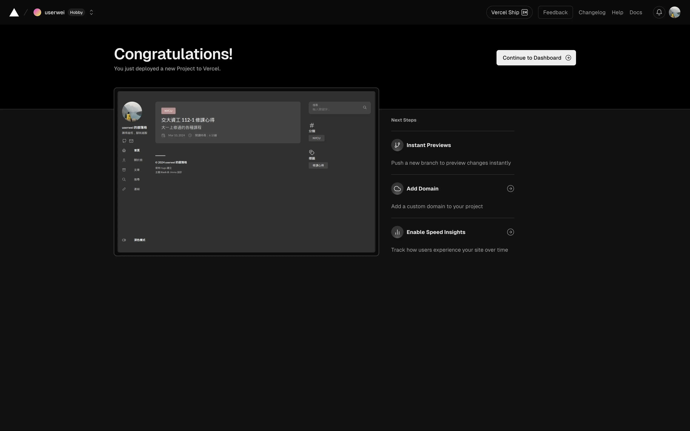
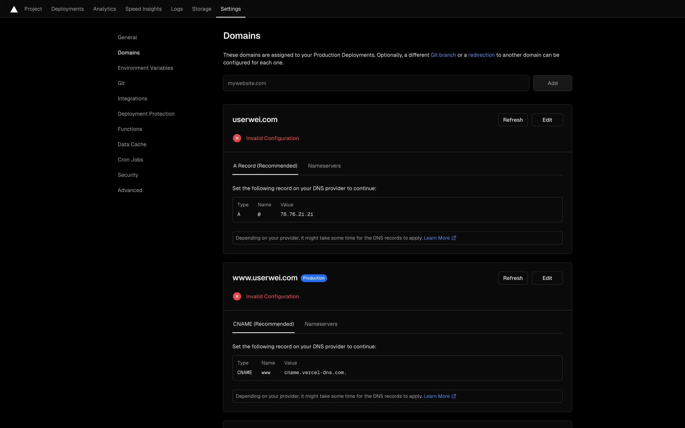
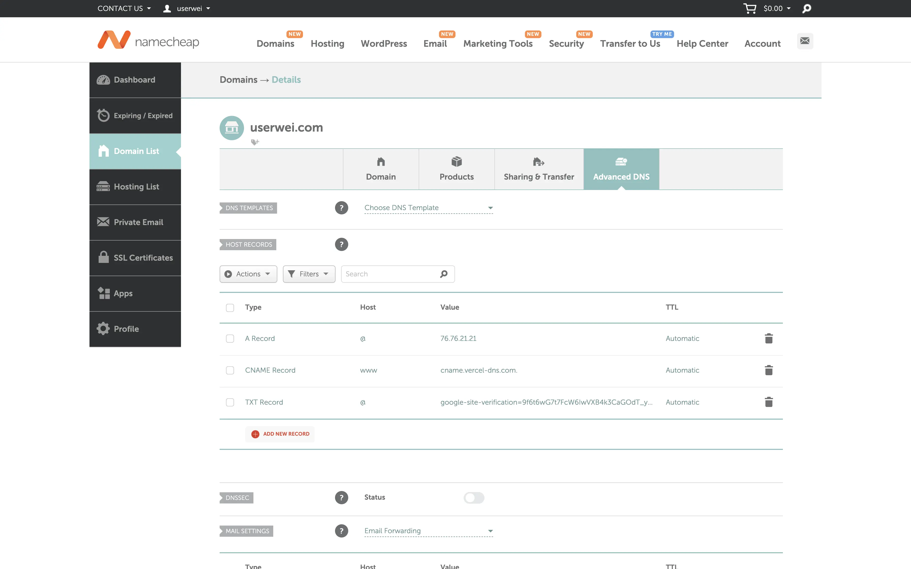

* 文章中所有以 `$` 為前綴的指令需被替換，若無特別說明則可以自行命名
* 有其他問題歡迎在文章下方留言或 [來信](mailto:userwei.blog@gmail.com) 詢問

## Hugo
[Hugo](https://gohugo.io/) 是基於 Go 語言開發的靜態網站生成器，號稱為世界上最快的網站建構工具。除了生成網頁的速度極快，Hugo 也有許多主題可供選擇，並支援實時渲染、多語系切換的功能，可以優化文章的寫作與網站架設的體驗。下方為比較 Hugo 和 Hexo 兩種靜態網站生成器的表格：

| 功能                | Hugo                                  | Hexo                                   |
|--------------------|---------------------------------------|----------------------------------------|
| **程式語言**       | Go                                    | Node.js                                |
| **速度**           | 非常快                                | 中等                                   |
| **主題 / 插件**      | 多                                     | 非常多                          |
| **內容格式**       | Markdown、HTML 等                     | Markdown、HTML 等                      |
| **學習難度**       | 中等                                  | 適合初學者                             |
| **依賴性**         | 無                                    | 需要 Node.js                           |
| **搜尋引擎優化**   | 內建支援                              | 需要透過插件                            |
| **多語言支援**     | 有                                    | 有                                     |

### 安裝 Hugo
由於 Hugo 並未提供 GUI，因此需要由終端機安裝，以下是 Hugo 官方提供在不同系統下的 [安裝方法](https://gohugo.io/categories/installation/)： 
```sh
# Windows
choco install hugo-extended

# macOS
brew install hugo

# Linux
sudo snap install hugo
```  
在安裝完成後使用以下指令測試 Hugo 是否安裝成功：
```sh
hugo version
```  
### 安裝 Git
至 [Git](https://git-scm.com/) 官網下載安裝。

### 初始化環境
選擇網頁存放的資料夾，並輸入以下指令新增網頁：
```sh
hugo new site $siteName
```  
完成後會在 `$siteName` 資料夾中生成以下的檔案：
```
├── archetypes
│   └── default.md
├── assets
├── content
├── data
├── hugo.toml
├── i18n
├── layouts
├── static
└── themes
```  
為了方便推送到 GitHub，我們先進入剛剛生成的資料夾初始化整個 Git 儲存庫：
```sh
cd $siteName
git init
```  

### 選擇主題
在 [Hugo Themes](https://themes.gohugo.io/) 中有提供許多類型的主題，可以依個人喜好挑選，這裡我選擇 [Stack](https://stack.jimmycai.com/) 主題作為範例。  

1. 在網站的根目錄中打開終端機，利用 `git submodule` 將主題下載至 `themes` 資料夾中：
    ```sh
    git submodule add https://github.com/CaiJimmy/hugo-theme-stack/ themes/hugo-theme-stack
    ```   
2. 刪除 `hugo.toml` 檔案並將 `themes/hugo-theme-stack` 中的 `config.yaml` 複製到根目錄中，在此檔案的最上方加入以下內容：
    ```yaml
    baseurl: https://example.com
    languageCode: zh-tw
    theme: hugo-theme-stack
    paginate: 5
    title: $blogTitle
    ```  
3. 其他設定可以參考 Stack 官方提供的 [Config](https://stack.jimmycai.com/config/) 依個人喜好修改：
   * 網站 icon 設定  
    將 `favicon.webp` 置於 `static` 的資料夾中，並在 `config.yaml` 修改以下內容：
        ```yaml
        params:
            favicon: favicon.webp
        ```  
   * 側邊欄設定  
      1. 將自己的大頭貼 `avatar.webp` 置於 `assets/img` 資料夾中（若無則自行新增），並在 `config.yaml` 修改以下內容：
            ```yaml
            params:
                sidebar:
                    compact: false
                    emoji: 
                    subtitle: $subTitle
                    avatar:
                        enabled: true
                        local: true
                        src: img/avatar.webp
            ```  
       2. 在副標題下方可以加上連結提供導向至自己的 GitHub 等網站，在 `config.yaml` 最下方新增以下內容：
            ```yaml
            menu:
                social:
                    - identifier: github
                      name: GitHub
                      url: $githubLink
                      params:
                          icon: brand-github
            ```  
       3. 若要新增導覽列則可參考 `themes/hugo-theme-stack/exampleSite` 中的檔案內容與架構，修改後 `content` 資料夾中的檔案架構將如下所示：
            ```
            ├── _index.md
            ├── categories
            ├── page
            │   ├── about
            │   │   └── index.md
            │   ├── archives
            │   │   └── index.md
            │   ├── links
            │   │   └── index.md
            │   └── search
            │       └── index.md
            └── post
            ```  
   * 文章設定  
        修改以下 `config.yaml` 的內容讓文章可以支援 LaTeX，並加上目錄、閱讀時長、預設 CC 授權等內容：
        ```yaml
        params:
            article:
                math: true
                toc: true
                readingTime: true
                license:
                    enabled: true
                    default: CC BY-NC-SA 4.0
        ```  
   * 留言設定
        1. 至 [Disqus](https://disqus.com/) 建立新帳戶，並創建新的 site，從設定中查詢 shortname。
        2. 修改以下 `config.yaml` 的內容以增加留言功能（將 `$shortName` 替換為 Disqus 設定中的 shortname）：
            ```yaml
            disqusShortname: $shortName
            params:
                comments:
                    enabled: true
                    provider: disqus

                    disqusjs:
                        shortname: $shortName
                        apiUrl:
                        apiKey:
                        admin:
                        adminLabel:
            ```  
   * widget 設定  
        修改以下 `config.yaml` 的內容使主頁及文章中顯示搜尋、目錄等小工具：
        ```yaml
        params:
            widgets:
                homepage:
                    - type: search
                    - type: categories
                    params:
                        limit: 10
                    - type: tag-cloud
                    params:
                        limit: 10
                page: 
                    - type: search
                    - type: toc
        ```  
   * zh-tw 用詞設定  
    將 `themes/hugo-theme-stack/i18n` 中的 `zh-tw.yaml` 複製到 `i18n` 資料夾中，並依需求更改：
        ```yaml
        toggleMenu:
            other: 切換選單
        darkMode:
            other: 深色模式

        ```  

### 撰寫文章
Hugo 需要使用 [Markdown](https://www.markdownguide.org/getting-started/) 語法來撰寫文章，這裡採用的方法是為每篇文章都建立一個資料夾，以方便整理資源。  
1. 在 `content/post` 的資料夾中新增一個以新文章名稱命名的資料夾（盡量使用英文，字與字間不要有空格）。
2. 在資料夾中新增 `index.md` 的檔案，`content/post` 資料夾中的檔案架構如下所示：
    ```
    ├── myPost
    │   └── index.md
    └── myPost2
        └── index.md
    ```  
3. 利用 [Visual Studio Code](https://code.visualstudio.com/) 等文字編輯器編輯 `index.md`，以下為基本的檔案內容（除文章屬性架構外皆可進行修改）：
    ```md
    ---
    title: myPost
    slug:  my-post
    date:  2024-05-20
    description: My first post
    categories:
        - Blog
    tags : 
        - First
    ---
    ## Hugo Blog
    content
    ```  

### 預覽 Hugo 網頁
透過內建的網頁即時預覽功能，可以讓我們了解網頁目前的內容。  
1. 在終端機中輸入以下指令：
    ```
    hugo server -D
    ```  
2. 若網頁沒有錯誤，終端機會顯示以下內容：
    ```
    Serving pages from disk
    Running in Fast Render Mode. For full rebuilds on change: hugo server --disableFastRender
    Web Server is available at http://localhost:1313/ (bind address 127.0.0.1) 
    Press Ctrl+C to stop
    ```  
3. 在瀏覽器中連上 `http://localhost:1313/` 即可預覽目前的網頁。

### 推送至 GitHub
為了接下來的網頁部署，需要將剛剛所生成的網頁推送到 [GitHub](https://github.com/) 上，具體步驟如下：  
1. 在 GitHub 上新開一個儲存庫，並將權限設為私人（Private），其餘設定皆保持原狀。

2. 在根目錄中建立 `.gitignore` 檔案，檔案內容如下：
    ```
    public
    resources
    assets/jsconfig.json
    .hugo_build.lock
    ```  
3. 複製頁面上儲存庫的網址 `https://github.com/xxx/xxx.git`，並在根目錄中執行以下指令（`$repoLink` 需替換成儲存庫的網址），將全部檔案推送到 GitHub 儲存庫中：
    ```sh
    git add .
    git commit -m "first commit"
    git branch -M main
    git remote add origin $repoLink
    git push -u origin main
    ```
## Vercel
[Vercel](https://vercel.com/) 是一個提供網頁的託管服務的平台，類似於 [GitHub Pages](https://pages.github.com/) 但更為強大、快速。另外 Vercel 也可以在有新的 Git 推送時自動化部署新的網頁，並每月提供 100GB 的免費流量，對小型網站架設是一大福音。下方表格為幾個常見網頁託管平台的比較：
| 功能            | Vercel                                 | Netlify                               | GitHub Pages            |
|-----------------|----------------------------------------|---------------------------------------|-------------------------|
| **最適用於**    | Next.js 應用                           | 靜態網站                              | 靜態網站                |
| **部署來源**     | GitHub、GitLab、Bitbucket              | GitHub、GitLab、Bitbucket             | 僅限 GitHub             |
| **建構速度**    | 極快                                   | 快                                    | 較慢                     |
| **頻寬限制**    | 每月 100GB（免費方案）                 | 每月 100GB（免費方案）                 | 無限制                   |
| **可靠性保證**  | 99.95%                                 | 99.99%                                | 無                       |
| **分析工具**    | 內建                                   | 內建                                   | 無                       |

### 部署網站
1. 至 Vercel 官網以 GitHub 登入。
2. 選擇 `Add New >> Project`，並於左側列表選擇剛剛設定好的 Git Repository。
3. 將 `Framework Preset` 設為 `Hugo`，並點擊展開 `Environment Variables` 加入 `HUGO_VERSION` 與本地端使用的版本（可使用 `hugo version` 指令查詢）：

4. 若看到以下畫面即完成網頁的部署。


### 連結域名
在後台中可以看到 Vercel 為剛剛部署的網頁提供了一個 `xxx.vercel.app` 網址，如果想更改為其他的自訂網址，則需要自行取得並連結域名。
1. 從 [Namecheap](https://www.namecheap.com/)、[GoDaddy](https://tw.godaddy.com/) 等網域註冊商取得一個域名。
2. 將 `config.yaml` 中的 `baseurl` 更改為取得的域名 `https://www.xxx.com`：
    ```yaml
    baseurl: $domainName
    ```
3. 進入後台 `Settings >> Domains` 加入取得的域名，選擇推薦的加入方式。加入後會顯示以下畫面：

4. 依照指示至網域註冊商設定 DNS：

5. 回到後台重整後，看到域名的設定都配置成功即完成設置：


### 網頁分析設定
在 Vercel 後台的導覽列上可以找到 `Analytics` 與 `Speed Insights` 的選項，可以用來了解目前網頁的成效。  
1. 在後台分別同意使用這兩種網頁分析，完成會顯示幾段程式碼需要加入自己的網頁中。
2. 於 `layouts` 資料夾中新增 `_default` 資料夾。
3. 從 `themes/hugo-theme-stack/layouts/_default` 中複製 `baseof.html` 至剛剛新增的 `layouts/_default` 資料夾，檔案架構如下所示：
    ```
    └── layouts
        └── _default
            └── baseof.html
    ```
4. 在 `baseof.html` 的 `<body>` 區塊中新增以下程式碼：
    ```html
    <script>
        window.si = window.si || function () { (window.siq = window.siq || []).push(arguments); };
    </script>
    <script defer src="/_vercel/speed-insights/script.js"></script>
    <script>
        window.va = window.va || function () { (window.vaq = window.vaq || []).push(arguments); };
    </script>
    <script defer src="/_vercel/insights/script.js"></script>
    ```
5. 將更新後的網站 push 至 GitHub，重整 Vercel 後台即可查看網頁分析。

## Google Search Console
[Google Search Console](https://search.google.com/search-console/about) 是由 Google 開發的 SEO 工具，可以提供網站所有者了解索引狀況、搜尋流量等資訊，進而優化網頁的搜索排名。  
### 新增網頁資源
1. 登入 Google Search Console 後選擇新增資源，輸入自己取得的域名：

2. 在網域註冊商的 DNS 中加上 Google 提供的驗證代碼 `google-site-verification=xxx`：

3. 等待所有權驗證成功後即可使用。

### Sitemap 設定
Sitemap 是一種網頁導覽的檔案，它記載所有網頁的連結與架構，讓搜尋引擎能快速理解網站內容架構，其中用途最廣泛的為 XML Sitemap。
1. 在 `config.yaml` 中新增以下設定使網頁自動產生 `sitemap.xml`：
    ```yaml
    sitemap:
        changeFreq: ""
        disable: false
        filename: sitemap.xml
        priority: -1
    ```
2. 將更新後的網站 push 至 GitHub，等待 Vercel 重新建置網頁。
3. 在 Google Search Console 的後台側邊欄選取 `Sitemap` 並新增 `https://www.xxx.com/sitemap.xml`。
4. 提交後狀態顯示成功即完成設定。